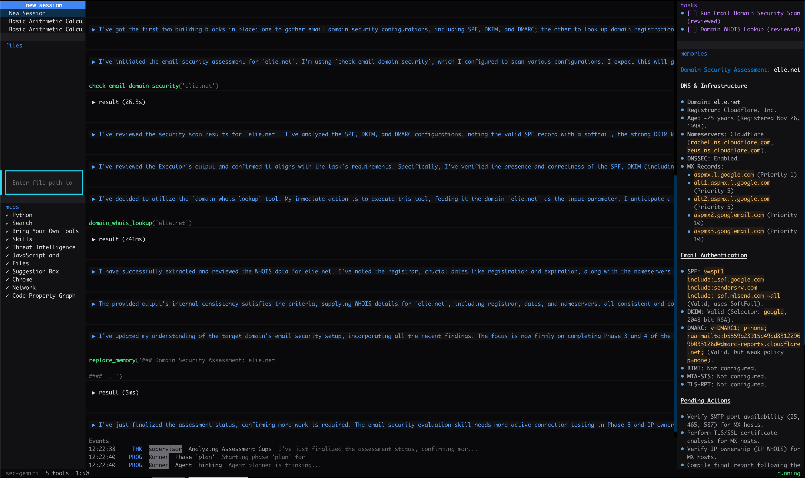

import { Tabs, TabItem } from '@astrojs/starlight/components';

The `sec-gemini-3` python package includes a built-in terminal user interface (TUI).

## Launching

You can either install the client permanently on your system or run it dynamically in ephemeral environments.

### Install and Run

The most common approach is to install the CLI tool globally. This allows you to launch the TUI anytime by simply typing `sec-gemini`.

<Tabs>
  <TabItem label="pipx">
  ```bash
  # Install the package globally
  pipx install sec-gemini-3

  # Launch the TUI
  sec-gemini
  ```
  </TabItem>
  <TabItem label="uv">
  ```bash
  # Install the package globally
  uv tool install sec-gemini-3

  # Launch the TUI
  sec-gemini
  ```
  </TabItem>
</Tabs>

### Run Without Installing

If you prefer not to install the package or want to try it out quickly, you can use temporary runners. Note that the package name is `sec-gemini-3` while the executable is `sec-gemini`.

<Tabs>
  <TabItem label="pipx">
  ```bash
  pipx run --spec sec-gemini-3 sec-gemini
  ```
  </TabItem>
  <TabItem label="uvx">
  ```bash
  uvx --from sec-gemini-3 sec-gemini
  ```
  </TabItem>
</Tabs>

On first launch, you'll be prompted for your API key. It's saved to `~/.config/sec-gemini/config.toml` for future sessions.

## Screenshot



## Keybindings

| Key | Action |
|-----|--------|
| `Ctrl+N` | New session |
| `Ctrl+L` | Toggle right panel (tasks, memory, MCPs) |
| `Ctrl+Q` | Quit |

## Layout

The TUI features a three-panel layout:

- **Left** -- Session list and MCP configuration
- **Center** -- Chat view (messages, tool calls, responses) and prompt input
- **Right** -- Tasks, memory, and MCP status (toggle with `Ctrl+L`)

## Configuration

Config is stored at `~/.config/sec-gemini/config.toml`:

```toml
[auth]
api_key = "your-api-key"
```

Override the config directory with the `SEC_GEMINI_CONFIG_DIR` environment variable.

Stream recordings are saved as JSONL files under `~/.config/sec-gemini/runs/`.
